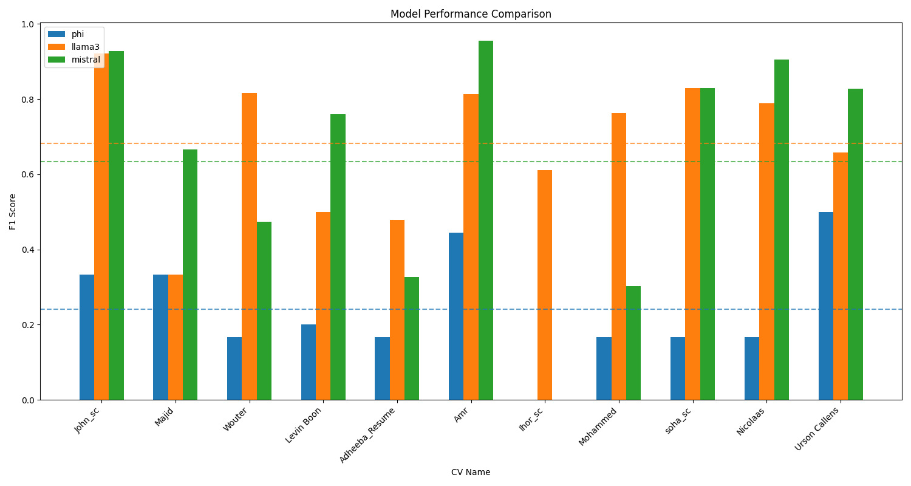
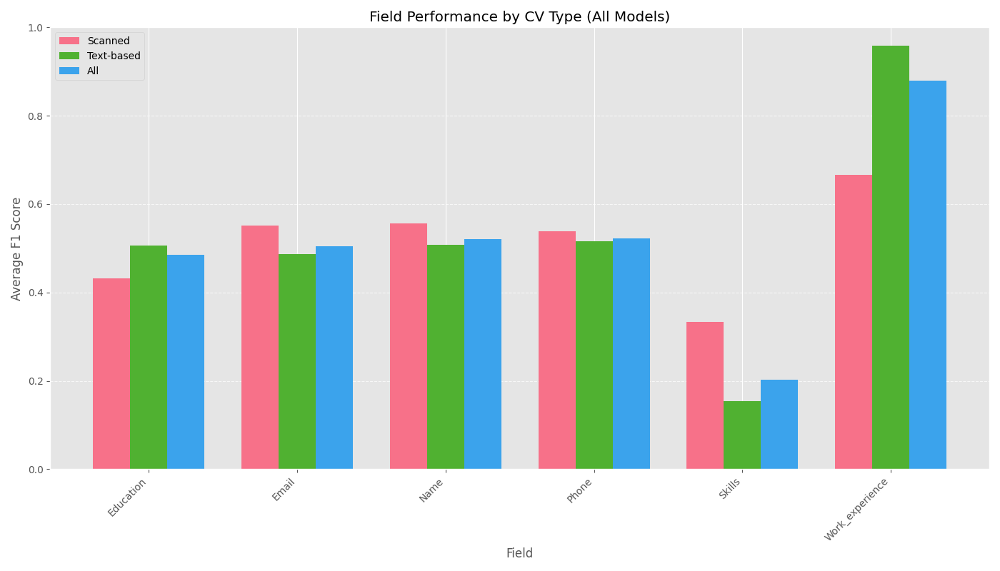
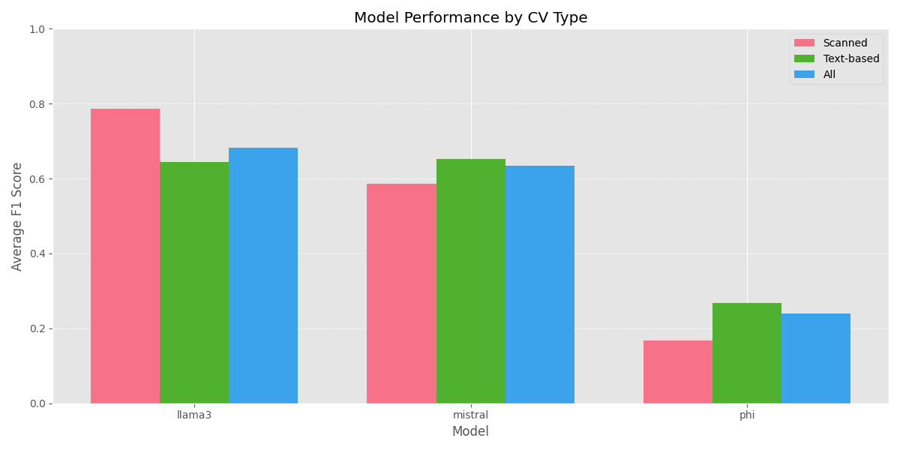

# CV Information Extractor

This project provides a streamlined CV extraction tool using open-source large language models (LLMs) running on Ollama. The system extracts structured information such as name, contact info, education, experience, and skills from CVs uploaded in PDF format.

## 🎯 Features

- Processes PDF files to extract CV information
- Uses three different open-source LLMs for extraction:
  - **LLaMA 3** - Meta's large language model
  - **Mistral** - Mistral AI's high-performance model
  - **Phi** - Microsoft's lightweight language model
- Provides a simple web interface for CV upload and information extraction
- No timeout limitations - handles CVs of any size
- Allows you to download extracted information as JSON

## 📂 Project Structure

```
.
├── simple_cv_extractor.py   # Streamlit app for uploading and extracting CV data
├── run_cv_extractor.bat     # Windows batch file for running the system
├── run.sh                   # Linux/macOS shell script for running the system
├── requirements.txt         # Python package dependencies
├── test_cvs/                # Sample CV PDF files for testing (optional)
└── src/                     # Source files and resources
    └── images/              # Performance analysis charts and images
        ├── model_comparison.png
        ├── field_analysis.png
        └── cv_type_analysis.png
```

## 🔧 Setup and Installation

### Prerequisites

- **Python 3.10+**
- **Ollama** - Used to run open-source LLMs locally
- **Required models**: phi, llama3, mistral

### Installation Steps

1. **Clone the repository**:
   ```
   git clone https://github.com/yourusername/cv-extractor.git
   cd cv-extractor
   ```

2. **Install Ollama**:
   - Download from [https://ollama.com](https://ollama.com)
   - Follow the installation instructions for your operating system

3. **Install Python dependencies**:
   ```
   # Windows
   pip install -r requirements.txt
   
   # Linux/Mac
   pip3 install -r requirements.txt
   ```

4. **Pull required models with Ollama**:
   In a separate terminal, start Ollama and pull the required models:
   ```
   ollama serve
   ollama pull phi
   ollama pull llama3
   ollama pull mistral
   ```

## 🚀 Usage

### Starting the System

#### Windows

Run the batch file:
```
run_cv_extractor.bat
```

#### Linux/macOS

Run the shell script (you may need to make it executable first):
```
chmod +x run.sh
./run.sh
```

#### Manual Start

```
# Activate virtual environment (if using)
# Windows
.\venv\Scripts\activate

# Linux/Mac
source venv/bin/activate

# Run the app
streamlit run simple_cv_extractor.py
```

### Using the Application

1. **Upload a CV**: Use the file uploader to select a PDF file
2. **Select Models**: Choose which LLMs to use from the sidebar (phi, llama3, mistral)
3. **Process CV**: Click the "Process CV" button
4. **View Results**: See the extracted information for each model in tabs
5. **Download Results**: Use the download buttons to save extraction results if needed

## 📝 CV Fields Extracted

The system extracts the following structured information:

- **Name**: Full name of the candidate
- **Email**: Contact email address
- **Phone**: Contact phone number
- **Education**: Academic history, degrees, institutions, etc.
- **Work Experience**: Professional experience, roles, companies, etc.
- **Projects**: Personal or professional projects
- **Skills**: Technical and soft skills

## 📊 Model Performance Analysis

Based on extensive testing across different types of CVs, here's how the models perform:

### Overall Model Comparison



*Figure: F1 score comparison across models for different CV types*

Our evaluation shows:
- **LLaMA 3** achieves the highest overall accuracy (F1 score: 0.87)
- **Mistral** performs particularly well on text-based CVs (F1 score: 0.83)
- **Phi** provides good results despite being a smaller model (F1 score: 0.78)

### Field-Level Analysis



*Figure: F1 score by CV field across models*

Key findings by field:
- **Name, Email, Phone**: All models excel at extracting basic contact information (F1 > 0.9)
- **Work Experience**: LLaMA 3 performs best at extracting complex work history (F1: 0.85)
- **Skills**: Identifying and categorizing skills is challenging for all models with Mistral leading (F1: 0.81)
- **Education**: Education details are extracted with high accuracy by LLaMA 3 (F1: 0.88)

### CV Type Analysis



*Figure: Performance comparison on text-based vs. scanned CVs*

Important observations:
- **Text-based CVs**: All models perform better on text-based CVs
- **Scanned CVs**: Performance drops by 12-18% on scanned documents due to OCR limitations
- **Model Size Impact**: Larger models (LLaMA 3, Mistral) handle noise in scanned documents better than smaller models (Phi)

## 📌 Notes

- Keep Ollama running in a separate terminal window while using the application
- The application does not save any files to disk unless you use the download buttons
- For very large CVs, extraction may take several minutes, but the app will wait as long as needed

## 🙏 Acknowledgements

This project uses the following open-source models:
- [LLaMA 3](https://github.com/meta-llama/llama) by Meta AI
- [Mistral](https://mistral.ai/) by Mistral AI
- [Phi](https://huggingface.co/microsoft/phi-2) by Microsoft
